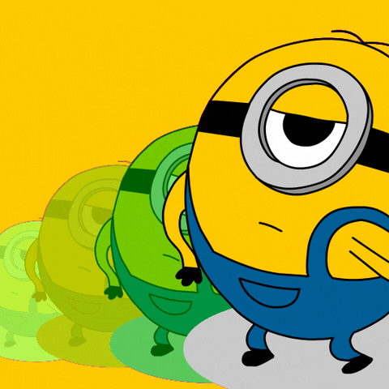

# HII
👋 Hi, my name is Moisés Nain, some friends call me Moi, others Nain, as you please.

👀 I’m interested in backend programming topics, design patterns and technologies, I like
to handle and retrieve data, designing databases, creating services based on
requirements,etc. 

Also I have little notions on front end development, writting HTML and css is not
so difficult to me, but in front end I wish to be upgrading my skills to become
fullstash at certain point of my career.

🌱 I’m currently learning Java Spring Boot, MongoDB, rabbit MQ and redis. My next topics to learn are
- Microservices
- Software arquitecture patterns and bases
- Machine learning, data science and AI field (cuz I'm kinda good into Mysql where
  it comes to cleaning data)
- CI/CD
- UX/UI
- SVG design

No matter how long it takes, I like to be digging into everything.

📫 If you wish to propose some hobby project to work together and working our skills up, 
you can catch me by sending me a message to:

- My <a href="https://www.linkedin.com/in/mois%C3%A9s-nain-soto-guzm%C3%A1n-61455b239/">Linkedin</a> account 
- Email: codiciaaa@protonmail.com

# One important thing about me... the minions are the best programmers 

# Just look how cute this mfs are

<!---
soynain/soynain is a ✨ special ✨ repository because its `README.md` (this file) appears on your GitHub profile.
You can click the Preview link to take a look at your changes.
--->
